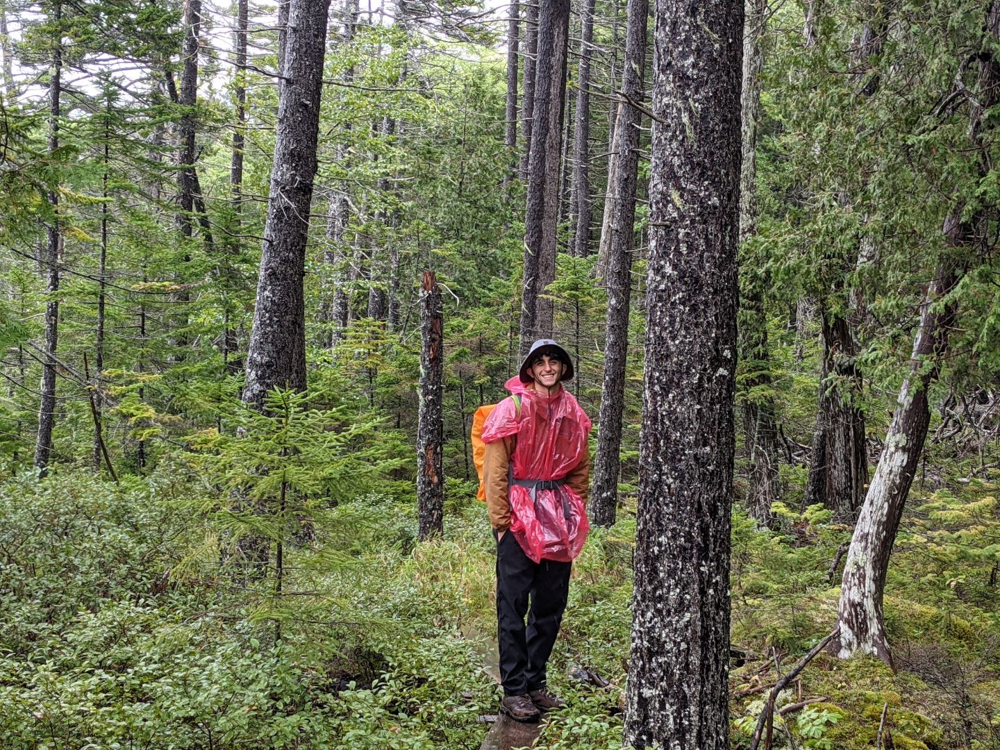

# Paolo Bartolucci

[LinkedIn](https://www.linkedin.com/in/paolo-bartolucci-693844201/)
[Github](https://github.com/paolobarto)

---

My name is Paolo Bartolucci and I am a rising Senior CSE major at Lehigh University. Prior to Lehigh, I attended Northampton Community College and recieved my A.S. in Computer Science. I am passionate about bettering my skills as a programmer and prepared to learn. I hope to learn more about Data Science as I move closer to my graduation and learn modern technologies such as Machine Learning. 

While attending Northampton Community College I was working as a Package Handler at UPS and eventually as Part-Time Supervisor. Closer to my graduation, my classes became increasingly difficult and I stopped working at UPS. Near to my graduation at NCC, I acquired a position as an Intern Software Developer at MIAC Analytics I have been working at MIAC for the last 1.5 years and plan on working while attending Lehigh. Over this summer as a continuation of my Capstone project, I will be working as a summer intern at Air Products. Once this position is complete, I will transition back to Working at MIAC as the semester restarts. 